# 👨‍⚖️ Guía de Integración - APP del Juez

> **Objetivo:** El juez revisa fotos de participantes, los valida/rechaza, crea eventos y ejecuta distribuciones de fondos.

---

## 📋 Tabla de Contenidos

1. [Resumen del Flujo](#-resumen-del-flujo)
2. [Setup Inicial](#-setup-inicial)
3. [Servicios Requeridos](#-servicios-requeridos)
4. [Componentes de UI](#-componentes-de-ui)
5. [Integración Completa](#-integración-completa)
6. [Testing](#-testing)
7. [Troubleshooting](#-troubleshooting)

---

## 🎯 Resumen del Flujo

```mermaid
sequenceDiagram
    participant J as Juez (Admin)
    participant APP as Judge App
    participant SC as Smart Contract
    participant Token as Token Contract
    participant Users as Usuarios

    J->>APP: 1. Login como admin
    APP->>SC: Verificar admin
    
    J->>APP: 2. Ver participantes pendientes
    APP->>SC: get_all_humans(start, limit)
    SC-->>APP: Lista de participantes
    APP->>J: Mostrar galería de fotos
    
    J->>APP: 3. Validar/Rechazar fotos
    APP->>SC: update_human_validation(address, true/false)
    
    J->>APP: 4. Crear evento
    APP->>SC: create_event(name, validated_addresses[])
    
    J->>APP: 5. Distribuir fondos
    APP->>Token: Aprobar transferencia
    APP->>SC: distribute_to_event(event_id, token, pool)
    SC->>Token: Transferir a cada participante
    Token-->>Users: Fondos distribuidos
    
    APP->>J: ✅ Distribución exitosa
```



---

## 🔧 Setup Inicial

### 1. Instalación de Dependencias

```bash
npm install @stellar/stellar-sdk axios
# O con yarn
yarn add @stellar/stellar-sdk axios
```

### 2. Variables de Entorno

Crea `.env.local`:

```env
# Stellar Network
REACT_APP_NETWORK=testnet
REACT_APP_RPC_URL=https://soroban-testnet.stellar.org
REACT_APP_NETWORK_PASSPHRASE=Test SDF Network ; September 2015

# Event Distributor Contract
REACT_APP_CONTRACT_ID=CCHFGFX3S52UX46HZEBEGW5N2LDDYMSJDLZF4CQOZ6TSWWKFEG4TFPLS

# Admin Address (para verificación)
REACT_APP_ADMIN_ADDRESS=GDL5432N2JCCAZBHG7EKHHVBRG2XQUI2WJGSRBK4R5OF3QNCOMDKZBEW

# IPFS Gateway
REACT_APP_IPFS_GATEWAY=https://gateway.pinata.cloud/ipfs/
```

---

## 📦 Servicios Requeridos

### Servicio: Judge Contract (`services/judgeContractService.js`)

```javascript
/**
 * services/judgeContractService.js
 * Funciones específicas para el juez/admin
 */

import {
  SorobanRpc,
  Contract,
  TransactionBuilder,
  Networks,
  BASE_FEE,
  nativeToScVal,
  Address,
  scValToNative,
  xdr
} from '@stellar/stellar-sdk';

// Configuración
const CONTRACT_ID = process.env.REACT_APP_CONTRACT_ID;
const ADMIN_ADDRESS = process.env.REACT_APP_ADMIN_ADDRESS;
const NETWORK_PASSPHRASE = process.env.REACT_APP_NETWORK_PASSPHRASE || Networks.TESTNET;
const RPC_URL = process.env.REACT_APP_RPC_URL || 'https://soroban-testnet.stellar.org';

const server = new SorobanRpc.Server(RPC_URL);

/**
 * Conectar wallet del admin
 * @returns {Promise<string>}
 */
export async function connectAdminWallet() {
  if (!window.freighter) {
    throw new Error('Freighter wallet no está instalado');
  }
  
  const publicKey = await window.freighter.getPublicKey();
  
  // Verificar que es el admin
  if (publicKey !== ADMIN_ADDRESS) {
    throw new Error('⚠️ No tienes permisos de administrador');
  }
  
  console.log('✅ Admin conectado:', publicKey);
  return publicKey;
}

/**
 * Verificar si una dirección es admin
 * @param {string} address
 * @returns {Promise<boolean>}
 */
export async function isAdmin(address) {
  try {
    const contract = new Contract(CONTRACT_ID);
    const dummyAccount = await server.getAccount(
      'GAAAAAAAAAAAAAAAAAAAAAAAAAAAAAAAAAAAAAAAAAAAAAAAAAAAAWHF'
    );
    
    const transaction = new TransactionBuilder(dummyAccount, {
      fee: BASE_FEE,
      networkPassphrase: NETWORK_PASSPHRASE
    })
      .addOperation(contract.call('get_admin'))
      .setTimeout(180)
      .build();
    
    const result = await server.simulateTransaction(transaction);
    
    if (result.results?.[0]?.retval) {
      const adminAddress = scValToNative(result.results[0].retval);
      return adminAddress === address;
    }
    
    return false;
  } catch (error) {
    console.error('Error verificando admin:', error);
    return false;
  }
}

/**
 * Obtener todos los participantes con paginación
 * @param {number} start - Índice inicial
 * @param {number} limit - Cantidad a obtener
 * @returns {Promise<Array>}
 */
export async function getAllHumans(start = 0, limit = 20) {
  try {
    const contract = new Contract(CONTRACT_ID);
    const dummyAccount = await server.getAccount(
      'GAAAAAAAAAAAAAAAAAAAAAAAAAAAAAAAAAAAAAAAAAAAAAAAAAAAAWHF'
    );
    
    const transaction = new TransactionBuilder(dummyAccount, {
      fee: BASE_FEE,
      networkPassphrase: NETWORK_PASSPHRASE
    })
      .addOperation(
        contract.call(
          'get_all_humans',
          nativeToScVal(start, { type: 'u32' }),
          nativeToScVal(limit, { type: 'u32' })
        )
      )
      .setTimeout(180)
      .build();
    
    const result = await server.simulateTransaction(transaction);
    
    if (result.results?.[0]?.retval) {
      const vec = result.results[0].retval.value();
      
      return vec.map(item => {
        const values = item.value();
        return {
          address: scValToNative(values[0]),
          ipfsHash: scValToNative(values[1]),
          validated: scValToNative(values[2])
        };
      });
    }
    
    return [];
  } catch (error) {
    console.error('Error obteniendo humanos:', error);
    return [];
  }
}

/**
 * Obtener solo humanos validados
 * @returns {Promise<Array>}
 */
export async function getValidatedHumans() {
  try {
    const contract = new Contract(CONTRACT_ID);
    const dummyAccount = await server.getAccount(
      'GAAAAAAAAAAAAAAAAAAAAAAAAAAAAAAAAAAAAAAAAAAAAAAAAAAAAWHF'
    );
    
    const transaction = new TransactionBuilder(dummyAccount, {
      fee: BASE_FEE,
      networkPassphrase: NETWORK_PASSPHRASE
    })
      .addOperation(contract.call('get_validated_humans'))
      .setTimeout(180)
      .build();
    
    const result = await server.simulateTransaction(transaction);
    
    if (result.results?.[0]?.retval) {
      const vec = result.results[0].retval.value();
      return vec.map(addr => scValToNative(addr));
    }
    
    return [];
  } catch (error) {
    console.error('Error obteniendo validados:', error);
    return [];
  }
}

/**
 * Validar o rechazar a un participante
 * @param {string} adminAddress - Dirección del admin
 * @param {string} humanAddress - Dirección del participante
 * @param {boolean} validated - true para validar, false para rechazar
 * @returns {Promise<object>}
 */
export async function updateHumanValidation(adminAddress, humanAddress, validated) {
  try {
    const sourceAccount = await server.getAccount(adminAddress);
    const contract = new Contract(CONTRACT_ID);
    
    const transaction = new TransactionBuilder(sourceAccount, {
      fee: BASE_FEE,
      networkPassphrase: NETWORK_PASSPHRASE
    })
      .addOperation(
        contract.call(
          'update_human_validation',
          new Address(humanAddress).toScVal(),
          nativeToScVal(validated, { type: 'bool' })
        )
      )
      .setTimeout(180)
      .build();
    
    // Preparar transacción
    const preparedTx = await server.prepareTransaction(transaction);
    
    // Firmar con Freighter
    const signedXDR = await window.freighter.signTransaction(
      preparedTx.toXDR(),
      {
        network: NETWORK_PASSPHRASE.includes('Test') ? 'TESTNET' : 'PUBLIC',
        networkPassphrase: NETWORK_PASSPHRASE
      }
    );
    
    // Enviar
    const txFromXDR = TransactionBuilder.fromXDR(signedXDR, NETWORK_PASSPHRASE);
    const sendResponse = await server.sendTransaction(txFromXDR);
    
    // Esperar confirmación
    let txStatus = await server.getTransaction(sendResponse.hash);
    let attempts = 0;
    
    while (txStatus.status === 'NOT_FOUND' && attempts < 30) {
      await new Promise(resolve => setTimeout(resolve, 1000));
      txStatus = await server.getTransaction(sendResponse.hash);
      attempts++;
    }
    
    if (txStatus.status === 'SUCCESS') {
      return {
        txHash: sendResponse.hash,
        status: 'success',
        validated
      };
    }
    
    throw new Error(`Transacción falló: ${txStatus.status}`);
    
  } catch (error) {
    console.error('Error actualizando validación:', error);
    throw error;
  }
}

/**
 * Crear un nuevo evento
 * @param {string} adminAddress - Dirección del admin
 * @param {string} eventName - Nombre del evento
 * @param {Array<string>} participantAddresses - Direcciones de participantes validados
 * @returns {Promise<object>}
 */
export async function createEvent(adminAddress, eventName, participantAddresses) {
  try {
    const sourceAccount = await server.getAccount(adminAddress);
    const contract = new Contract(CONTRACT_ID);
    
    // Convertir array de addresses a ScVal
    const addressesScVal = nativeToScVal(
      participantAddresses.map(addr => new Address(addr)),
      { type: 'Vec' }
    );
    
    const transaction = new TransactionBuilder(sourceAccount, {
      fee: BASE_FEE,
      networkPassphrase: NETWORK_PASSPHRASE
    })
      .addOperation(
        contract.call(
          'create_event',
          nativeToScVal(eventName, { type: 'string' }),
          addressesScVal
        )
      )
      .setTimeout(180)
      .build();
    
    const preparedTx = await server.prepareTransaction(transaction);
    
    const signedXDR = await window.freighter.signTransaction(
      preparedTx.toXDR(),
      {
        network: NETWORK_PASSPHRASE.includes('Test') ? 'TESTNET' : 'PUBLIC',
        networkPassphrase: NETWORK_PASSPHRASE
      }
    );
    
    const txFromXDR = TransactionBuilder.fromXDR(signedXDR, NETWORK_PASSPHRASE);
    const sendResponse = await server.sendTransaction(txFromXDR);
    
    // Esperar confirmación
    let txStatus = await server.getTransaction(sendResponse.hash);
    let attempts = 0;
    
    while (txStatus.status === 'NOT_FOUND' && attempts < 30) {
      await new Promise(resolve => setTimeout(resolve, 1000));
      txStatus = await server.getTransaction(sendResponse.hash);
      attempts++;
    }
    
    if (txStatus.status === 'SUCCESS') {
      // Extraer event_id del resultado
      const result = txStatus.returnValue;
      const eventId = scValToNative(result);
      
      return {
        eventId,
        txHash: sendResponse.hash,
        status: 'success'
      };
    }
    
    throw new Error(`Transacción falló: ${txStatus.status}`);
    
  } catch (error) {
    console.error('Error creando evento:', error);
    throw error;
  }
}

/**
 * Obtener eventos creados
 * @param {number} start
 * @param {number} limit
 * @returns {Promise<Array>}
 */
export async function getEvents(start = 0, limit = 10) {
  try {
    const contract = new Contract(CONTRACT_ID);
    const dummyAccount = await server.getAccount(
      'GAAAAAAAAAAAAAAAAAAAAAAAAAAAAAAAAAAAAAAAAAAAAAAAAAAAAWHF'
    );
    
    const transaction = new TransactionBuilder(dummyAccount, {
      fee: BASE_FEE,
      networkPassphrase: NETWORK_PASSPHRASE
    })
      .addOperation(
        contract.call(
          'get_events',
          nativeToScVal(start, { type: 'u32' }),
          nativeToScVal(limit, { type: 'u32' })
        )
      )
      .setTimeout(180)
      .build();
    
    const result = await server.simulateTransaction(transaction);
    
    if (result.results?.[0]?.retval) {
      const vec = result.results[0].retval.value();
      
      return vec.map(item => {
        const values = item.value();
        return {
          id: scValToNative(values[0]),
          name: scValToNative(values[1]),
          participants: scValToNative(values[2])
        };
      });
    }
    
    return [];
  } catch (error) {
    console.error('Error obteniendo eventos:', error);
    return [];
  }
}

/**
 * Distribuir fondos a un evento
 * @param {string} adminAddress
 * @param {number} eventId
 * @param {string} tokenAddress - Dirección del token a distribuir
 * @param {string} poolAmount - Monto total a distribuir (en stroops)
 * @returns {Promise<object>}
 */
export async function distributeToEvent(adminAddress, eventId, tokenAddress, poolAmount) {
  try {
    const sourceAccount = await server.getAccount(adminAddress);
    const contract = new Contract(CONTRACT_ID);
    
    const transaction = new TransactionBuilder(sourceAccount, {
      fee: BASE_FEE,
      networkPassphrase: NETWORK_PASSPHRASE
    })
      .addOperation(
        contract.call(
          'distribute_to_event',
          nativeToScVal(eventId, { type: 'u32' }),
          new Address(tokenAddress).toScVal(),
          nativeToScVal(BigInt(poolAmount), { type: 'i128' })
        )
      )
      .setTimeout(180)
      .build();
    
    const preparedTx = await server.prepareTransaction(transaction);
    
    const signedXDR = await window.freighter.signTransaction(
      preparedTx.toXDR(),
      {
        network: NETWORK_PASSPHRASE.includes('Test') ? 'TESTNET' : 'PUBLIC',
        networkPassphrase: NETWORK_PASSPHRASE
      }
    );
    
    const txFromXDR = TransactionBuilder.fromXDR(signedXDR, NETWORK_PASSPHRASE);
    const sendResponse = await server.sendTransaction(txFromXDR);
    
    // Esperar confirmación
    let txStatus = await server.getTransaction(sendResponse.hash);
    let attempts = 0;
    
    while (txStatus.status === 'NOT_FOUND' && attempts < 30) {
      await new Promise(resolve => setTimeout(resolve, 1000));
      txStatus = await server.getTransaction(sendResponse.hash);
      attempts++;
    }
    
    if (txStatus.status === 'SUCCESS') {
      return {
        txHash: sendResponse.hash,
        status: 'success',
        explorerUrl: `https://stellar.expert/explorer/testnet/tx/${sendResponse.hash}`
      };
    }
    
    throw new Error(`Distribución falló: ${txStatus.status}`);
    
  } catch (error) {
    console.error('Error distribuyendo:', error);
    throw error;
  }
}

/**
 * Obtener URL de imagen IPFS
 * @param {string} ipfsHash
 * @returns {string}
 */
export function getIPFSUrl(ipfsHash) {
  const gateway = process.env.REACT_APP_IPFS_GATEWAY || 'https://gateway.pinata.cloud/ipfs/';
  return `${gateway}${ipfsHash}`;
}

/**
 * Obtener estadísticas del contrato
 * @returns {Promise<object>}
 */
export async function getContractStats() {
  try {
    const allHumans = await getAllHumans(0, 1000);
    const validated = allHumans.filter(h => h.validated);
    const pending = allHumans.filter(h => !h.validated);
    const events = await getEvents(0, 1000);
    
    return {
      totalHumans: allHumans.length,
      validatedCount: validated.length,
      pendingCount: pending.length,
      totalEvents: events.length,
      validationRate: allHumans.length > 0 
        ? (validated.length / allHumans.length * 100).toFixed(1)
        : 0
    };
  } catch (error) {
    console.error('Error obteniendo stats:', error);
    return {
      totalHumans: 0,
      validatedCount: 0,
      pendingCount: 0,
      totalEvents: 0,
      validationRate: 0
    };
  }
}
```

---

## 🎨 Componentes de UI

### Componente 1: Dashboard del Juez

```jsx
/**
 * components/JudgeDashboard.jsx
 */

import React, { useState, useEffect } from 'react';
import {
  connectAdminWallet,
  isAdmin,
  getAllHumans,
  getContractStats,
  getEvents
} from '../services/judgeContractService';
import ParticipantGallery from './ParticipantGallery';
import EventManager from './EventManager';
import './JudgeDashboard.css';

function JudgeDashboard() {
  const [adminAddress, setAdminAddress] = useState('');
  const [isAdminUser, setIsAdminUser] = useState(false);
  const [stats, setStats] = useState(null);
  const [activeTab, setActiveTab] = useState('participants'); // participants, events, stats
  const [loading, setLoading] = useState(false);
  const [error, setError] = useState('');

  // Conectar wallet
  const handleConnect = async () => {
    try {
      setLoading(true);
      setError('');
      
      const address = await connectAdminWallet();
      setAdminAddress(address);
      
      const adminStatus = await isAdmin(address);
      setIsAdminUser(adminStatus);
      
      if (!adminStatus) {
        setError('⚠️ No tienes permisos de administrador');
        return;
      }
      
      // Cargar stats
      await loadStats();
      
    } catch (err) {
      setError(err.message);
    } finally {
      setLoading(false);
    }
  };

  // Cargar estadísticas
  const loadStats = async () => {
    try {
      const data = await getContractStats();
      setStats(data);
    } catch (err) {
      console.error('Error cargando stats:', err);
    }
  };

  // Recargar datos cuando cambie de tab
  useEffect(() => {
    if (isAdminUser) {
      loadStats();
    }
  }, [activeTab, isAdminUser]);

  return (
    <div className="judge-dashboard">
      {/* Header */}
      <header className="dashboard-header">
        <div className="header-content">
          <h1>👨‍⚖️ Panel del Juez</h1>
          <p>Gestiona participantes, validaciones y distribuciones</p>
        </div>
        
        {!adminAddress ? (
          <button onClick={handleConnect} disabled={loading} className="btn btn-primary">
            {loading ? '⏳ Conectando...' : '🔗 Conectar Wallet Admin'}
          </button>
        ) : (
          <div className="admin-info">
            <span className="admin-badge">👨‍⚖️ Admin</span>
            <span className="address">{adminAddress.slice(0, 8)}...{adminAddress.slice(-4)}</span>
          </div>
        )}
      </header>

      {/* Error */}
      {error && (
        <div className="alert alert-error">
          {error}
        </div>
      )}

      {/* Stats Dashboard */}
      {isAdminUser && stats && (
        <div className="stats-grid">
          <div className="stat-card">
            <div className="stat-icon">👥</div>
            <div className="stat-value">{stats.totalHumans}</div>
            <div className="stat-label">Total Participantes</div>
          </div>
          
          <div className="stat-card validated">
            <div className="stat-icon">✅</div>
            <div className="stat-value">{stats.validatedCount}</div>
            <div className="stat-label">Validados</div>
          </div>
          
          <div className="stat-card pending">
            <div className="stat-icon">⏳</div>
            <div className="stat-value">{stats.pendingCount}</div>
            <div className="stat-label">Pendientes</div>
          </div>
          
          <div className="stat-card">
            <div className="stat-icon">🎪</div>
            <div className="stat-value">{stats.totalEvents}</div>
            <div className="stat-label">Eventos Creados</div>
          </div>
        </div>
      )}

      {/* Tabs */}
      {isAdminUser && (
        <>
          <div className="tabs">
            <button 
              className={activeTab === 'participants' ? 'tab active' : 'tab'}
              onClick={() => setActiveTab('participants')}
            >
              👥 Participantes
            </button>
            <button 
              className={activeTab === 'events' ? 'tab active' : 'tab'}
              onClick={() => setActiveTab('events')}
            >
              🎪 Eventos
            </button>
          </div>

          {/* Tab Content */}
          <div className="tab-content">
            {activeTab === 'participants' && (
              <ParticipantGallery 
                adminAddress={adminAddress}
                onValidationChange={loadStats}
              />
            )}
            
            {activeTab === 'events' && (
              <EventManager 
                adminAddress={adminAddress}
                onEventCreated={loadStats}
              />
            )}
          </div>
        </>
      )}
    </div>
  );
}

export default JudgeDashboard;
```

### Componente 2: Galería de Participantes

```jsx
/**
 * components/ParticipantGallery.jsx
 */

import React, { useState, useEffect } from 'react';
import {
  getAllHumans,
  updateHumanValidation,
  getIPFSUrl
} from '../services/judgeContractService';
import './ParticipantGallery.css';

function ParticipantGallery({ adminAddress, onValidationChange }) {
  const [participants, setParticipants] = useState([]);
  const [filteredParticipants, setFilteredParticipants] = useState([]);
  const [filter, setFilter] = useState('all'); // all, validated, pending
  const [loading, setLoading] = useState(false);
  const [processingIds, setProcessingIds] = useState(new Set());
  const [selectedImage, setSelectedImage] = useState(null);

  // Cargar participantes
  useEffect(() => {
    loadParticipants();
  }, []);

  // Filtrar participantes
  useEffect(() => {
    if (filter === 'all') {
      setFilteredParticipants(participants);
    } else if (filter === 'validated') {
      setFilteredParticipants(participants.filter(p => p.validated));
    } else if (filter === 'pending') {
      setFilteredParticipants(participants.filter(p => !p.validated));
    }
  }, [filter, participants]);

  const loadParticipants = async () => {
    try {
      setLoading(true);
      const data = await getAllHumans(0, 100);
      setParticipants(data);
    } catch (error) {
      console.error('Error cargando participantes:', error);
    } finally {
      setLoading(false);
    }
  };

  const handleValidate = async (address, validated) => {
    try {
      setProcessingIds(prev => new Set(prev).add(address));
      
      await updateHumanValidation(adminAddress, address, validated);
      
      // Actualizar localmente
      setParticipants(prev =>
        prev.map(p =>
          p.address === address ? { ...p, validated } : p
        )
      );
      
      // Notificar cambio
      if (onValidationChange) {
        onValidationChange();
      }
      
    } catch (error) {
      alert(`Error: ${error.message}`);
    } finally {
      setProcessingIds(prev => {
        const newSet = new Set(prev);
        newSet.delete(address);
        return newSet;
      });
    }
  };

  return (
    <div className="participant-gallery">
      {/* Filters */}
      <div className="gallery-header">
        <h2>Galería de Participantes</h2>
        
        <div className="filters">
          <button
            className={filter === 'all' ? 'filter-btn active' : 'filter-btn'}
            onClick={() => setFilter('all')}
          >
            Todos ({participants.length})
          </button>
          <button
            className={filter === 'validated' ? 'filter-btn active' : 'filter-btn'}
            onClick={() => setFilter('validated')}
          >
            ✅ Validados ({participants.filter(p => p.validated).length})
          </button>
          <button
            className={filter === 'pending' ? 'filter-btn active' : 'filter-btn'}
            onClick={() => setFilter('pending')}
          >
            ⏳ Pendientes ({participants.filter(p => !p.validated).length})
          </button>
        </div>
      </div>

      {/* Loading */}
      {loading && (
        <div className="loading">
          <div className="spinner"></div>
          <p>Cargando participantes...</p>
        </div>
      )}

      {/* Gallery Grid */}
      {!loading && (
        <div className="gallery-grid">
          {filteredParticipants.map((participant) => (
            <div key={participant.address} className="participant-card">
              <div 
                className="image-container"
                onClick={() => setSelectedImage(participant)}
              >
                 {
                    e.target.src = 'data:image/svg+xml,<svg xmlns="http://www.w3.org/2000/svg" width="200" height="200"><rect fill="%23ddd"/><text x="50%" y="50%" text-anchor="middle" dy=".3em">❌ Error</text></svg>';
                  }}
                />
                <div className={`status-badge ${participant.validated ? 'validated' : 'pending'}`}>
                  {participant.validated ? '✅' : '⏳'}
                </div>
              </div>
              
              <div className="card-info">
                <div className="address-short">
                  {participant.address.slice(0, 8)}...{participant.address.slice(-4)}
                </div>
                
                <div className="card-actions">
                  {!participant.validated ? (
                    <button
                      onClick={() => handleValidate(participant.address, true)}
                      disabled={processingIds.has(participant.address)}
                      className="btn btn-success btn-sm"
                    >
                      {processingIds.has(participant.address) ? '⏳' : '✅ Validar'}
                    </button>
                  ) : (
                    <button
                      onClick={() => handleValidate(participant.address, false)}
                      disabled={processingIds.has(participant.address)}
                      className="btn btn-danger btn-sm"
                    >
                      {processingIds.has(participant.address) ? '⏳' : '❌ Rechazar'}
                    </button>
                  )}
                </div>
              </div>
            </div>
          ))}
        </div>
      )}

      {/* Empty State */}
      {!loading && filteredParticipants.length === 0 && (
        <div className="empty-state">
          <div className="empty-icon">📭</div>
          <p>No hay participantes {filter !== 'all' && `${filter === 'validated' ? 'validados' : 'pendientes'}`}</p>
        </div>
      )}

      {/* Image Modal */}
      {selectedImage && (
        <div className="image-modal" onClick={() => setSelectedImage(null)}>
          <div className="modal-content" onClick={(e) => e.stopPropagation()}>
            <button className="close-btn" onClick={() => setSelectedImage(null)}>×</button>
            
            <div className="modal-info">
              <p><strong>Address:</strong> {selectedImage.address}</p>
              <p><strong>IPFS:</strong> {selectedImage.ipfsHash}</p>
              <p><strong>Estado:</strong> {selectedImage.validated ? '✅ Validado' : '⏳ Pendiente'}</p>
            </div>
          </div>
        </div>
      )}
    </div>
  );
}

export default ParticipantGallery;
```

### Componente 3: Gestor de Eventos

```jsx
/**
 * components/EventManager.jsx
 */

import React, { useState, useEffect } from 'react';
import {
  getValidatedHumans,
  createEvent,
  getEvents,
  distributeToEvent,
  getAllHumans
} from '../services/judgeContractService';
import './EventManager.css';

function EventManager({ adminAddress, onEventCreated }) {
  const [validatedHumans, setValidatedHumans] = useState([]);
  const [allHumans, setAllHumans] = useState([]);
  const [events, setEvents] = useState([]);
  const [eventName, setEventName] = useState('');
  const [selectedParticipants, setSelectedParticipants] = useState([]);
  const [loading, setLoading] = useState(false);
  const [creating, setCreating] = useState(false);
  const [showCreateForm, setShowCreateForm] = useState(false);

  useEffect(() => {
    loadData();
  }, []);

  const loadData = async () => {
    try {
      setLoading(true);
      const [validated, all, eventList] = await Promise.all([
        getValidatedHumans(),
        getAllHumans(0, 100),
        getEvents(0, 50)
      ]);
      
      setValidatedHumans(validated);
      setAllHumans(all);
      setEvents(eventList);
    } catch (error) {
      console.error('Error cargando datos:', error);
    } finally {
      setLoading(false);
    }
  };

  const handleCreateEvent = async () => {
    if (!eventName.trim()) {
      alert('Ingresa un nombre para el evento');
      return;
    }
    
    if (selectedParticipants.length === 0) {
      alert('Selecciona al menos un participante');
      return;
    }
    
    try {
      setCreating(true);
      
      const result = await createEvent(adminAddress, eventName, selectedParticipants);
      
      alert(`✅ Evento creado! ID: ${result.eventId}`);
      
      // Reset form
      setEventName('');
      setSelectedParticipants([]);
      setShowCreateForm(false);
      
      // Reload data
      await loadData();
      
      if (onEventCreated) {
        onEventCreated();
      }
      
    } catch (error) {
      alert(`Error: ${error.message}`);
    } finally {
      setCreating(false);
    }
  };

  const toggleParticipant = (address) => {
    setSelectedParticipants(prev =>
      prev.includes(address)
        ? prev.filter(a => a !== address)
        : [...prev, address]
    );
  };

  const selectAllValidated = () => {
    setSelectedParticipants(validatedHumans);
  };

  const getParticipantInfo = (address) => {
    return allHumans.find(h => h.address === address);
  };

  return (
    <div className="event-manager">
      <div className="manager-header">
        <h2>🎪 Gestor de Eventos</h2>
        <button 
          onClick={() => setShowCreateForm(!showCreateForm)}
          className="btn btn-primary"
        >
          {showCreateForm ? '❌ Cancelar' : '➕ Crear Evento'}
        </button>
      </div>

      {/* Create Event Form */}
      {showCreateForm && (
        <div className="create-event-form">
          <h3>Crear Nuevo Evento</h3>
          
          <div className="form-group">
            <label>Nombre del Evento</label>
            <input
              type="text"
              value={eventName}
              onChange={(e) => setEventName(e.target.value)}
              placeholder="ej: Evento de Verano 2025"
              className="form-input"
            />
          </div>

          <div className="form-group">
            <div className="label-with-action">
              <label>Participantes ({selectedParticipants.length} seleccionados)</label>
              <button 
                onClick={selectAllValidated}
                className="btn-link"
              >
                Seleccionar todos los validados ({validatedHumans.length})
              </button>
            </div>
            
            <div className="participants-list">
              {validatedHumans.map(address => {
                const info = getParticipantInfo(address);
                const isSelected = selectedParticipants.includes(address);
                
                return (
                  <div 
                    key={address}
                    className={`participant-item ${isSelected ? 'selected' : ''}`}
                    onClick={() => toggleParticipant(address)}
                  >
                    <input 
                      type="checkbox"
                      checked={isSelected}
                      onChange={() => {}}
                    />
                    <span className="address">
                      {address.slice(0, 8)}...{address.slice(-4)}
                    </span>
                    {info && (
                      <span className="badge">✅ Validado</span>
                    )}
                  </div>
                );
              })}
            </div>
          </div>

          <button 
            onClick={handleCreateEvent}
            disabled={creating || selectedParticipants.length === 0}
            className="btn btn-primary btn-block"
          >
            {creating ? '⏳ Creando...' : `✅ Crear Evento con ${selectedParticipants.length} participantes`}
          </button>
        </div>
      )}

      {/* Events List */}
      <div className="events-list">
        <h3>Eventos Creados ({events.length})</h3>
        
        {loading && (
          <div className="loading">
            <div className="spinner"></div>
            <p>Cargando eventos...</p>
          </div>
        )}

        {!loading && events.length === 0 && (
          <div className="empty-state">
            <p>No hay eventos creados aún</p>
          </div>
        )}

        {!loading && events.length > 0 && (
          <div className="events-grid">
            {events.map(event => (
              <div key={event.id} className="event-card">
                <div className="event-header">
                  <h4>{event.name}</h4>
                  <span className="event-id">ID: {event.id}</span>
                </div>
                
                <div className="event-stats">
                  <div className="stat">
                    <span className="stat-label">Participantes:</span>
                    <span className="stat-value">{event.participants.length}</span>
                  </div>
                </div>
                
                <button className="btn btn-secondary btn-sm">
                  📊 Ver Detalles
                </button>
              </div>
            ))}
          </div>
        )}
      </div>
    </div>
  );
}

export default EventManager;
```

### Estilos CSS

```css
/**
 * components/JudgeDashboard.css
 */

.judge-dashboard {
  max-width: 1400px;
  margin: 0 auto;
  padding: 20px;
}

.dashboard-header {
  display: flex;
  justify-content: space-between;
  align-items: center;
  margin-bottom: 30px;
  padding: 20px;
  background: linear-gradient(135deg, #667eea 0%, #764ba2 100%);
  color: white;
  border-radius: 12px;
}

.header-content h1 {
  margin: 0 0 5px 0;
  font-size: 2em;
}

.header-content p {
  margin: 0;
  opacity: 0.9;
}

.admin-info {
  display: flex;
  align-items: center;
  gap: 10px;
  background: rgba(255, 255, 255, 0.2);
  padding: 10px 15px;
  border-radius: 8px;
}

.admin-badge {
  background: #4caf50;
  padding: 4px 12px;
  border-radius: 20px;
  font-size: 0.9em;
  font-weight: 600;
}

.stats-grid {
  display: grid;
  grid-template-columns: repeat(auto-fit, minmax(250px, 1fr));
  gap: 20px;
  margin-bottom: 30px;
}

.stat-card {
  background: white;
  padding: 25px;
  border-radius: 12px;
  box-shadow: 0 2px 8px rgba(0, 0, 0, 0.1);
  text-align: center;
  transition: transform 0.3s ease;
}

.stat-card:hover {
  transform: translateY(-5px);
  box-shadow: 0 4px 12px rgba(0, 0, 0, 0.15);
}

.stat-icon {
  font-size: 3em;
  margin-bottom: 10px;
}

.stat-value {
  font-size: 2.5em;
  font-weight: 700;
  color: #333;
  margin-bottom: 5px;
}

.stat-label {
  color: #666;
  font-size: 0.95em;
}

.stat-card.validated {
  border-left: 4px solid #4caf50;
}

.stat-card.pending {
  border-left: 4px solid #ff9800;
}

.tabs {
  display: flex;
  gap: 10px;
  margin-bottom: 20px;
  border-bottom: 2px solid #e0e0e0;
}

.tab {
  padding: 12px 24px;
  border: none;
  background: none;
  font-size: 1em;
  font-weight: 600;
  color: #666;
  cursor: pointer;
  border-bottom: 3px solid transparent;
  transition: all 0.3s ease;
}

.tab:hover {
  color: #7D00FF;
}

.tab.active {
  color: #7D00FF;
  border-bottom-color: #7D00FF;
}

.tab-content {
  background: white;
  border-radius: 12px;
  padding: 20px;
  box-shadow: 0 2px 8px rgba(0, 0, 0, 0.1);
}

/* Participant Gallery */
.participant-gallery {
  padding: 20px;
}

.gallery-header {
  display: flex;
  justify-content: space-between;
  align-items: center;
  margin-bottom: 20px;
}

.filters {
  display: flex;
  gap: 10px;
}

.filter-btn {
  padding: 8px 16px;
  border: 2px solid #e0e0e0;
  background: white;
  border-radius: 20px;
  cursor: pointer;
  transition: all 0.3s ease;
}

.filter-btn:hover {
  border-color: #7D00FF;
}

.filter-btn.active {
  background: #7D00FF;
  color: white;
  border-color: #7D00FF;
}

.gallery-grid {
  display: grid;
  grid-template-columns: repeat(auto-fill, minmax(250px, 1fr));
  gap: 20px;
}

.participant-card {
  background: white;
  border-radius: 12px;
  overflow: hidden;
  box-shadow: 0 2px 8px rgba(0, 0, 0, 0.1);
  transition: transform 0.3s ease;
}

.participant-card:hover {
  transform: translateY(-5px);
  box-shadow: 0 4px 12px rgba(0, 0, 0, 0.15);
}

.image-container {
  position: relative;
  width: 100%;
  height: 250px;
  overflow: hidden;
  cursor: pointer;
}

.image-container img {
  width: 100%;
  height: 100%;
  object-fit: cover;
}

.status-badge {
  position: absolute;
  top: 10px;
  right: 10px;
  padding: 6px 12px;
  border-radius: 20px;
  font-size: 1.2em;
  background: rgba(255, 255, 255, 0.9);
}

.card-info {
  padding: 15px;
}

.address-short {
  font-family: monospace;
  font-size: 0.9em;
  color: #666;
  margin-bottom: 10px;
}

.card-actions {
  display: flex;
  gap: 10px;
}

.btn-sm {
  padding: 8px 16px;
  font-size: 0.9em;
  flex: 1;
}

.btn-success {
  background: #4caf50;
  color: white;
}

.btn-danger {
  background: #f44336;
  color: white;
}

.image-modal {
  position: fixed;
  top: 0;
  left: 0;
  right: 0;
  bottom: 0;
  background: rgba(0, 0, 0, 0.9);
  display: flex;
  align-items: center;
  justify-content: center;
  z-index: 1000;
}

.modal-content {
  position: relative;
  max-width: 90%;
  max-height: 90%;
  background: white;
  border-radius: 12px;
  padding: 20px;
}

.modal-content img {
  max-width: 100%;
  max-height: 70vh;
  border-radius: 8px;
}

.close-btn {
  position: absolute;
  top: 10px;
  right: 10px;
  background: white;
  border: none;
  width: 40px;
  height: 40px;
  border-radius: 50%;
  font-size: 1.5em;
  cursor: pointer;
  box-shadow: 0 2px 8px rgba(0, 0, 0, 0.2);
}

.modal-info {
  margin-top: 15px;
  font-size: 0.9em;
}

.modal-info p {
  margin: 5px 0;
}

/* Event Manager */
.event-manager {
  padding: 20px;
}

.manager-header {
  display: flex;
  justify-content: space-between;
  align-items: center;
  margin-bottom: 20px;
}

.create-event-form {
  background: #f9f9f9;
  padding: 20px;
  border-radius: 12px;
  margin-bottom: 30px;
}

.form-group {
  margin-bottom: 20px;
}

.form-group label {
  display: block;
  margin-bottom: 8px;
  font-weight: 600;
  color: #333;
}

.form-input {
  width: 100%;
  padding: 12px;
  border: 2px solid #e0e0e0;
  border-radius: 8px;
  font-size: 1em;
}

.form-input:focus {
  outline: none;
  border-color: #7D00FF;
}

.label-with-action {
  display: flex;
  justify-content: space-between;
  align-items: center;
  margin-bottom: 10px;
}

.btn-link {
  background: none;
  border: none;
  color: #7D00FF;
  cursor: pointer;
  text-decoration: underline;
  font-size: 0.9em;
}

.participants-list {
  max-height: 300px;
  overflow-y: auto;
  border: 2px solid #e0e0e0;
  border-radius: 8px;
  padding: 10px;
}

.participant-item {
  display: flex;
  align-items: center;
  gap: 10px;
  padding: 10px;
  border-radius: 6px;
  cursor: pointer;
  transition: background 0.2s ease;
}

.participant-item:hover {
  background: #f0f0f0;
}

.participant-item.selected {
  background: #e3f2fd;
  border: 2px solid #2196f3;
}

.btn-block {
  width: 100%;
}

.events-grid {
  display: grid;
  grid-template-columns: repeat(auto-fill, minmax(300px, 1fr));
  gap: 20px;
}

.event-card {
  background: white;
  padding: 20px;
  border-radius: 12px;
  border: 2px solid #e0e0e0;
}

.event-header {
  display: flex;
  justify-content: space-between;
  align-items: center;
  margin-bottom: 15px;
}

.event-id {
  background: #e0e0e0;
  padding: 4px 10px;
  border-radius: 12px;
  font-size: 0.85em;
}

.event-stats {
  margin-bottom: 15px;
}

.empty-state {
  text-align: center;
  padding: 40px;
  color: #999;
}

.empty-icon {
  font-size: 4em;
  margin-bottom: 10px;
}

.loading {
  text-align: center;
  padding: 40px;
}

.spinner {
  width: 50px;
  height: 50px;
  border: 4px solid #f3f3f3;
  border-top: 4px solid #7D00FF;
  border-radius: 50%;
  animation: spin 1s linear infinite;
  margin: 0 auto 20px;
}

@keyframes spin {
  0% { transform: rotate(0deg); }
  100% { transform: rotate(360deg); }
}

/* Responsive */
@media (max-width: 768px) {
  .dashboard-header {
    flex-direction: column;
    gap: 15px;
    text-align: center;
  }
  
  .stats-grid {
    grid-template-columns: 1fr;
  }
  
  .gallery-grid {
    grid-template-columns: 1fr;
  }
  
  .events-grid {
    grid-template-columns: 1fr;
  }
}
```

---

## 🧪 Testing

```javascript
// Flujo completo de testing

// 1. Conectar como admin
const adminAddr = await connectAdminWallet();

// 2. Verificar permisos
const isAdm = await isAdmin(adminAddr);
console.log('¿Es admin?:', isAdm);

// 3. Obtener participantes
const humans = await getAllHumans(0, 10);
console.log('Participantes:', humans);

// 4. Validar uno
const result = await updateHumanValidation(adminAddr, humans[0].address, true);
console.log('Validación:', result);

// 5. Obtener validados
const validated = await getValidatedHumans();
console.log('Validados:', validated);

// 6. Crear evento
const event = await createEvent(adminAddr, 'Test Event', validated);
console.log('Evento creado:', event);

// 7. Ver estadísticas
const stats = await getContractStats();
console.log('Stats:', stats);
```

---

## 🐛 Troubleshooting

### Error: "No tienes permisos de administrador"
**Solución:** Solo la cuenta admin configurada puede ejecutar estas operaciones

### Error: "HumanNotFound"
**Solución:** El participante no existe en el contrato

### Error: "EventNotFound"
**Solución:** El ID del evento no existe

### Participantes no cargan
**Solución:** Verificar que el RPC_URL esté correcto y funcionando

---

## 📊 Funciones del Contrato para Juez

| Función | Descripción | Requiere Auth |
|---------|-------------|---------------|
| `get_admin()` | Obtener dirección admin | No |
| `get_all_humans(start, limit)` | Lista paginada | No |
| `get_validated_humans()` | Solo validados | No |
| `update_human_validation(addr, bool)` | Validar/rechazar | ✅ Admin |
| `update_human_image(addr, ipfs)` | Cambiar imagen | ✅ Admin |
| `create_event(name, addresses[])` | Crear evento | ✅ Admin |
| `get_events(start, limit)` | Lista eventos | No |
| `distribute_to_event(id, token, pool)` | Distribuir fondos | ✅ Admin |

---

## 🔗 Recursos

- **Contract:** `CCHFGFX3S52UX46HZEBEGW5N2LDDYMSJDLZF4CQOZ6TSWWKFEG4TFPLS`
- **Admin:** `GDL5432N2JCCAZBHG7EKHHVBRG2XQUI2WJGSRBK4R5OF3QNCOMDKZBEW`
- **Explorer:** https://stellar.expert/explorer/testnet/contract/CCHFGFX3S52UX46HZEBEGW5N2LDDYMSJDLZF4CQOZ6TSWWKFEG4TFPLS

---

**✅ ¡Listo para gestionar participantes y eventos!**
